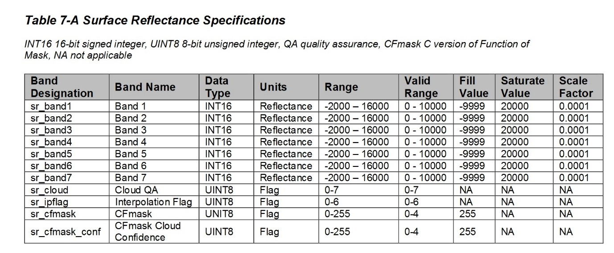
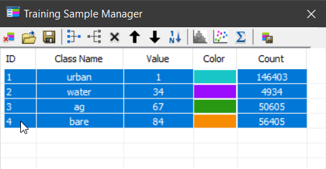

# Land surface Temperature of Bengaluru
**Hypothesis:** The Urban temperature is on average more than natural(soil, vegetation).

**Assumption:** Emissivity values are assumed because of not having field values.

| Class name | Class value | Emissivity |
| ----------- | ----------- | ----------- |
|Urban|1|0.98|
|Water	| 34	| 0.94 |
|agg |	67	| 0.98 |
|Bare |	84	| 0.93 |

#### To derive the land surface temperature, steps followed are
-	Conversion of DN number to TOA radiance
-	Conversion to At-Satellite Brightness temperature
-	Land surface temperature formula

**The values for the below formula have been taken from USGS Earth Explorer meta data file for landsat 8**
---

| Discription | Value |
| ----------- | ----------- |
| RADIANCE_ADD_BAND_10 | 0.1 |
| RADIANCE_MULTI_BAND_10 | 3.34E-04 |
| K1_constant_band_10 | 774.8853 |
| K2_constant_band_10 | 1321.0789 |

Here's a sentence with a footnote. 

**The following equations have been derived from ESRI’s blog** [1](#myfootnote1)
1. Conversion to TOA Radiance

 > L= M*Q +A
 
 ***L= TOA spectral radiance | M= band specific multiplicative rescaling factor | A= band specific additive rescaling factor | Q= DN number***

2. Conversion to At-Satellite Brightness temp

> T= k2/(ln(k1/L +1)

***T= at-satellite brightness temp (K) | L= TOA spectral radiance | K1= band specific thermal conversion | K2= band specific thermal conversion***

3.	Land surface temperature formula

> BT/(1+w*(BT/p)*ln(e))

***BT= at satellite temperature | W= wavelength of emitted radiance | P=14380***

### Procedure to-be followed

1.	Downloaded image from google earth engine in TIF format
- Date of capture: 27 Jan, 2020
- Location: bangalore, India
- WRS PATH 144
- WRS ROW 51
2.	Used con tool to remove negative value from red, blue, green band
- Values for red, blue green band contained negative values which are not permitted for evaluation. The source was found to be Table 7-A. Only values greater than 0 were accepted.

3.	Made training sample according to stratified strategy
- Samples were trained after making true color composite proportion to the size of each class.
- 4 classes were made with values as mentioned above. The signature file and polygons shape file were saved.

4.	Classified the data using maximum likelihood classifier
- The MLC was used and the confidence raster was used to test the accuracy of the classification.
- The samples were modified until sufficient accuracy for confidence accuracy

5.	Reclassify the MLC output
- Since the reclassify tool does not take values less than 1, the values of emissivity were given as percentage.
- This was converted to float points using raster calculator in next step.

6.	Used the formula to convert DN number to radiance
- The thermal band was used to perform raster calculations. 
   - Conversion to TOA Radiance
> L= M*Q +A

Where,
L= TOA spectral radiance
M= band specific multiplicative rescaling factor
A= band specific additive rescaling factor
Q= DN number

7. The satellite read temperature was calculated. (TB10 in model)
- Used the formula to at-satellite temperature
>  T= k2/(ln(k1/L +1)

Where,
T= at-satellite brightness temp (K),
L= TOA spectral radiance,
K1= band specific thermal conversion,
K2= band specific thermal conversion,

8.	Land surface temperature formula
>	BT/(1+w*(BT/p)*ln(e))

Where,
BT= at satellite temperature, 
W= wavelength of emitted radiance, 
P=14380

 

---

### **The hypothesis was proved wrong. The agriculture field had an average of 6 degrees more than urban. The min and max were almost same, this may be because of the misclassified pixels. Though the standard deviation says that those are not a major in number.**

**Limitations:**
The model uses emissivity value which are for generalised here. Actual emissivity should be calculated in the field for each class. 
The classification has mixed pixels and are fairly complex to separate if not knowing the ground truth. 
The thermal band is 100 m resolution but resampled to 30 m. This causes many pixels to assume a permanent value and not fussy classification. 
The values of K1, K2 are sensitive to the band range DN numbers. A small deflection can vary the temperature by degrees. 

**Future scope:**
The formula here are empirical, thus some other formula or method can be used and also evaluate the accuracy by ground measured temperature. 

<a name="myfootnote1">1</a>: [ESRI blog](https://www.esri.com/arcgis-blog/products/product/analytics/deriving-temperature-from-landsat-8-thermal-bands-tirs/?rmedium=redirect&rsource=blogs.esri.com/esri/arcgis/2014/01/06/deriving-temperature-from-landsat-8-thermal-bands-tirs) 
<a name="#myfootnote2">2</a> [LST comparision](fulltext83122015.pdf)
